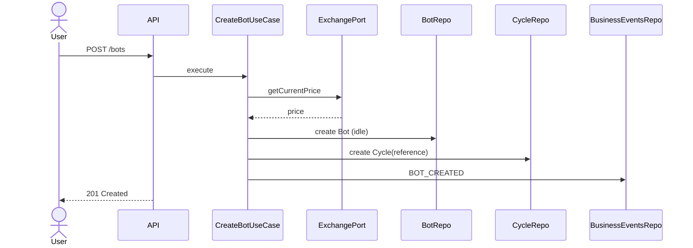
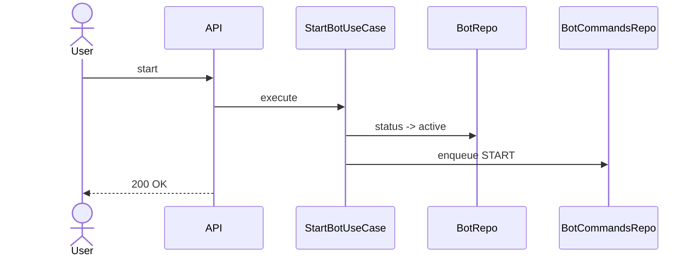
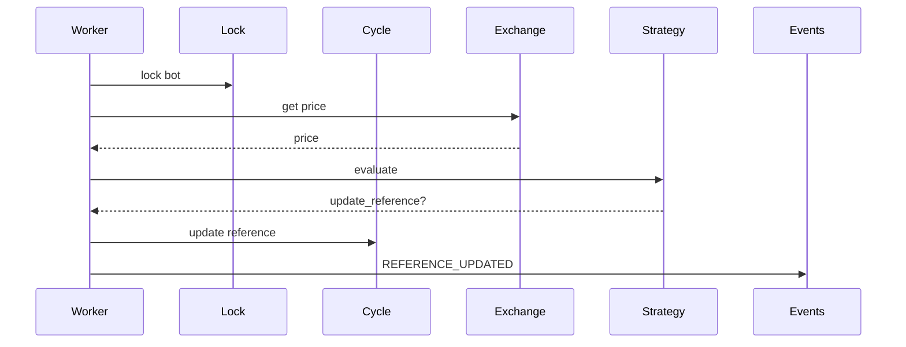
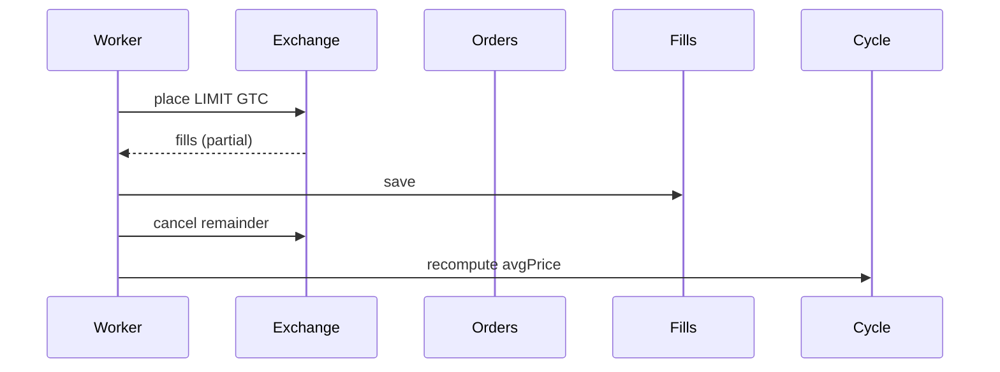
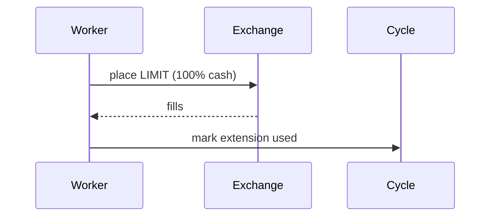
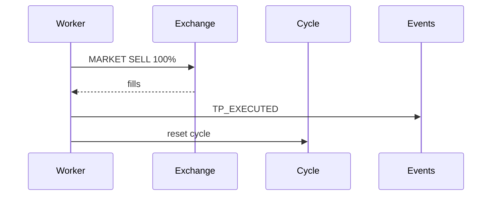
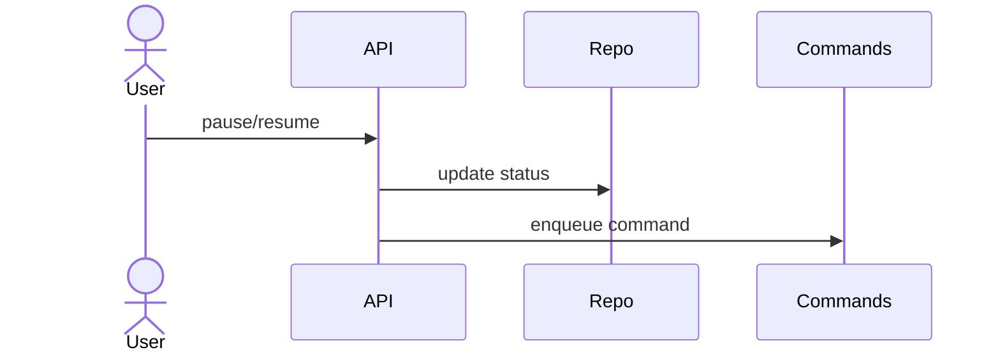
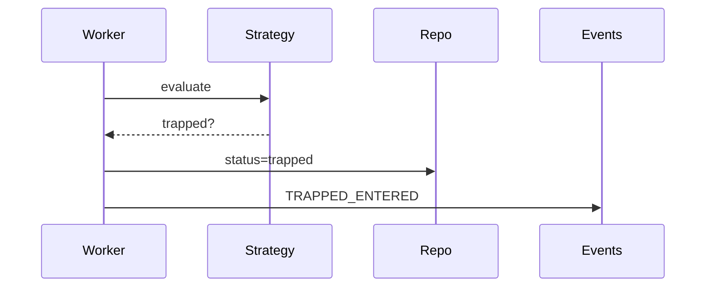

# Diagramas de Secuencia — Bot Trading Spot DCA TP

Este documento consolida **todos los diagramas de secuencia (texto + Mermaid)** y la **validación final**, usando **exclusivamente** como fuente de verdad:

- PRD_Bot_Trading_Spot_DCA_TP.md
- adr_bot_trading_spot_final.md
- backlog_funcional_bot_spot_dca_tp_v_2.md
- BACKLOG_TECNICO_BOT_SPOT_DCA_TP_v3.md

No se inventan funcionalidades ni se rellenan huecos.

---

## UC-01 — Crear bot (referencia inicial = precio de mercado)

### Referencias
- PRD §6, §7.2, §9
- ADR-04, ADR-18, ADR-30
- US-01, UC-01
- TECH-020, TECH-021, TECH-023, TECH-040, TECH-041, TECH-043, TECH-065

### Participantes
User · API · CreateBotUseCase · ExchangePort · BotRepo · CycleRepo · BusinessEventsRepo

### Secuencia
1. POST /bots
2. Obtener precio actual del exchange
3. Crear Bot (idle)
4. Crear Cycle con referencePrice
5. Emitir BOT_CREATED
6. Responder 201

---

## UC-02 — Iniciar bot

### Referencias
- PRD §5.1, §9
- ADR-05, ADR-09
- US-02, UC-02
- TECH-024, TECH-044, TECH-063, TECH-066

### Secuencia
1. POST /bots/:id/start
2. Cambiar estado a active
3. Encolar comando START

---

## UC-03 — Actualizar referencia dinámica (pre-compra)

### Referencias
- PRD §7.2
- ADR-07, ADR-31
- US-03, UC-03
- TECH-030, TECH-053, TECH-054, TECH-055

---

## UC-04 / UC-06 — Compra regular LIMIT GTC + parcial + cancelación

### Referencias
- PRD §7.3, §7.8
- ADR-15, ADR-19
- US-04, US-06A, US-06B
- TECH-047, TECH-056, TECH-057, TECH-058

---

## UC-05 — Compra de extensión

### Referencias
- PRD §7.4
- ADR-19
- US-05, UC-05
- TECH-032

---

## UC-07 / UC-08 — Take Profit + reinicio de ciclo

### Referencias
- PRD §7.6, §7.7
- ADR-20
- US-07, US-08
- TECH-034, TECH-035, TECH-059

---

## UC-09 / UC-10 — Pausar / Reanudar bot

### Referencias
- PRD §5.1
- ADR-05, ADR-09
- US-09, US-10
- TECH-025, TECH-026

---

## UC-12 — Bot en estado trapped

### Referencias
- PRD §11, §12
- ADR-06
- US-12
- TECH-036, TECH-061

---

# Hallazgos de validación

## Gap #1 — Estado `no_cash`
Definido en PRD pero sin UC ni flujo en backlog.

## Gap #2 — Condición exacta de `trapped`
No está formalizada en PRD/ADR. Backlog técnico la sugiere → ambigüedad.

## Ambigüedad #1 — Command bus
Existe en ADR/backlog, no explícito en PRD.

## Riesgo técnico #1 — Cancelación de remanentes
No hay flujo de reconciliación si cancel falla o llega tarde.

## Riesgo técnico #2 — Notificaciones
Set de eventos difiere entre PRD y ADR.

---

**Conclusión:**  
Con estos diagramas se puede evaluar que el sistema es *mayoritariamente coherente*, pero existen **ambigüedades y riesgos reales** que deben resolverse antes de implementación productiva.
